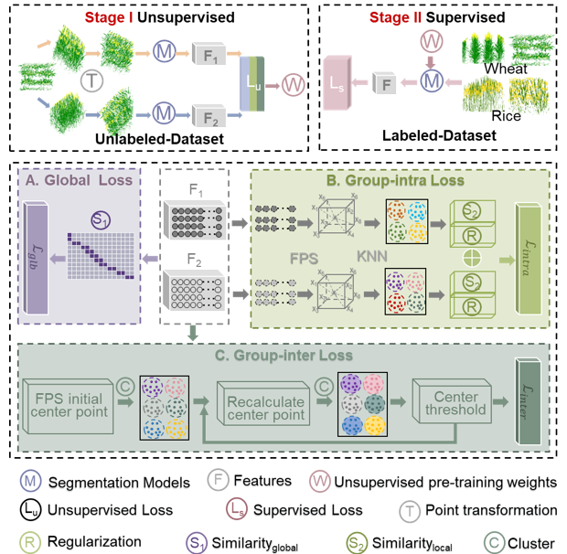
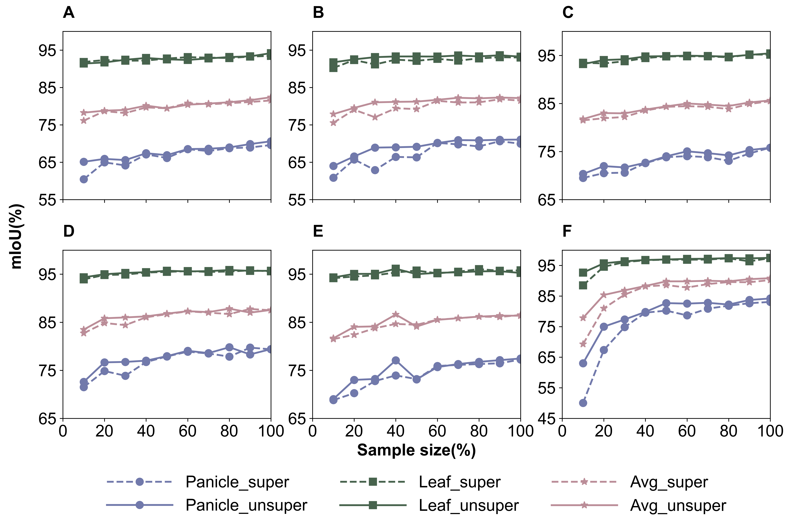
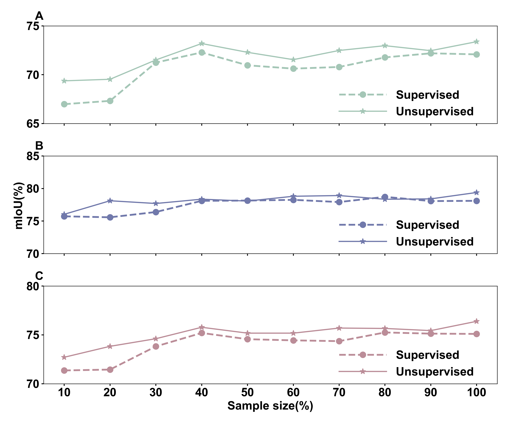

# Crop3D

*****Crop-3D***: A Comprehensive Unsupervised Segmentation Framework for Crop Point Cloud under Limited Labeling Conditions**

-  Innovation: We introduced a two-stage unsupervised segmentation framework (***Crop-3D***) to alleviate the challenge of leaf ear segmentation in wheat and rice point clouds. The framework is mainly composed of four modules: adaptive point cloud transformation, global similarity, intra-class similarity, and inter-class separation.

<p align="center">

</p>

## 

## Module Introduction
[***Crop-3D***](https://github.com/Tang-855/3D-Seg/) consists of four major components：. 

1. **Adaptive point cloud branching transformation**: randomly selects a combination of rotation, scaling and translation strategies in a local neighborhood to generate branching point clouds with similar global semantic features;
   
2. **Global similarity module**: calculates the similarity of two branching point clouds on a global scale;

3. **Intra-class similarity module**: evaluates the similarity between each neighboring point and the sample centroid in the same superpoint by constructing a loss function in the KNN grouped neighborhood;

4. **Inter-class similarity module**: unsupervised clustering grouping through clustering algorithms (e.g., K-means++), initial clustering superpoints based on the realization of the three-dimensional coordinate features of the two branch point clouds, based on the fusion of the three-dimensional coordinate features and high-dimensional features, to complete further iterative clustering process
---


## ***Crop3D*** showed a significant improvement in segmentation performance for rice and wheat point clouds.  

**Wheat**
-  Under the 10 sample sizes of [10%, 20%, 30%, 40%, 50%, 60%, 70%, 80%, 90%, 100%], the segmentation performance of *DGCNN, Point Cloud Transformer, PointNet++, PointNeXt, PointMLP* and *PointConv* based on fully supervised learning and ***Crop-3D*** has been improved to varying degrees.
<p align="center">

</p>


**Rice**
-  Based on the *PointMLP* model, the mIoU trend of unsupervised and fully supervised learning in different rice samples
<p align="center">

</p>

## Model Performance
Performance of ***Crop-3D*** improvements are shown in the following areas:

1. **Robustness**: ***Crop-3D*** show segmentation performance on *DGCNN, Point Cloud Transformer, PointNet++, PointNeXt, PointMLP* and *PointConv* models.

2. **Smaller sample size**：***Crop-3D*** provide more improvement in segmentation accuracy when the amount of training data is smaller.

3. **Extensibility**：***Crop-3D*** Significantly Improves Accuracy of Small-Sample Training on Wheat and Rice Datasets


## Installation
We provide a simple bash file to install the environment:

```
git clone --recurse-submodules git@github.com:Tang-855/3D-Seg.git
cd 3D-Seg
source update.sh
source install.sh
```
If the above command fails to install successfully, please open the `install.sh` and follow the steps to install manually. See [Install](https://github.com/Tang-855/3D-Seg/blob/main/install.sh) for detail. 


## Run 

Check our [***Crop-3D***](https://github.com/Tang-855/3D-Seg/) for detailed instructions. 

The installation commands for *DGCNN, Point Cloud Transformer, PointNet++, PointNeXt, PointMLP* and *PointConv* models are basically the same, using DGCNN as an example:
For example: 
-  Running the DGCNN model:

```
chmod +x nohup.sh
./nohup.sh &
```

---

### Acknowledgment
This library is inspired by [PointNeXt](https://guochengqian.github.io/PointNeXt/modelzoo/). 

### Citation
If you find ***Crop-3D*** useful, please cite.
