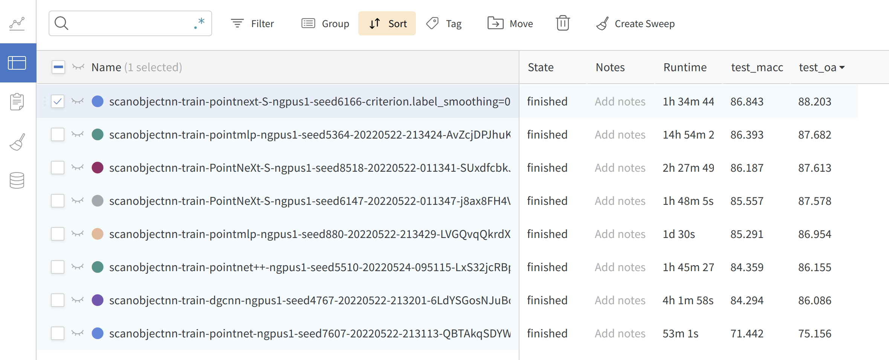
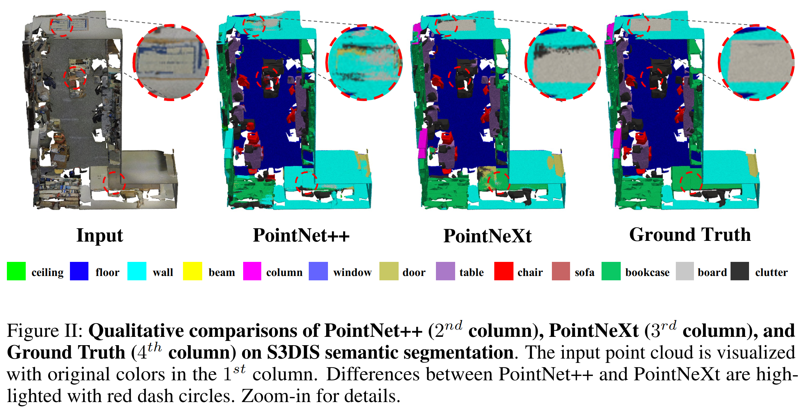
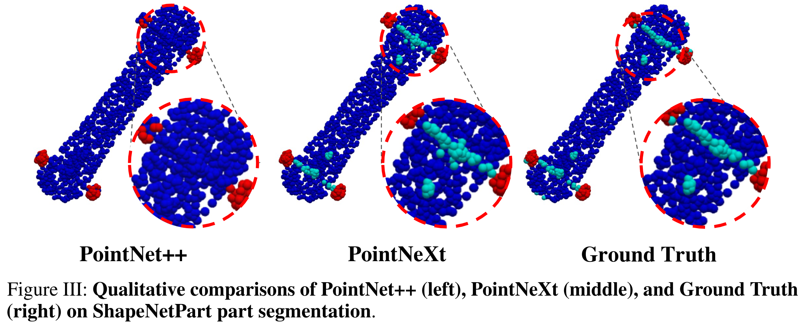

# Crop3D

**Crop3D: A Comprehensive Unsupervised Segmentation Framework for Crop Point Cloud under Limited Labeling Conditions**

-  Innovation: We introduced a two-stage unsupervised segmentation framework (Crop-3D) to alleviate the challenge of leaf ear segmentation in wheat and rice point clouds. The framework is mainly composed of four modules: adaptive point cloud transformation, global similarity, intra-class similarity, and inter-class separation.

<p align="center">

</p>

##         

## On rice and wheat point clouds, Crop3D showed a significant improvement in segmentation performance

**Wheat**
-  Under the 10 sample sizes of [10%, 20%, 30%, 40%, 50%, 60%, 70%, 80%, 90%, 100%], the segmentation performance of DGCNN, PointCloud Transformer, classic PointNet++, PointNeXt, PointMLP and PointConv based on fully supervised learning and unsupervised learning frameworks has been improved to varying degrees.
<p align="center">

</p>


**Rice**
-  Based on the PointMLP model, the mIoU trend of unsupervised and fully supervised learning in different rice samples
<p align="center">

</p>

## Features
In the PointNeXt project, we propose a new and flexible codebase for point-based methods, namely [**OpenPoints**](https://github.com/guochengqian/openpoints). The biggest difference between OpenPoints and other libraries is that we focus more on reproducibility and fair benchmarking. 

1. **Extensibility**: supports many representative networks for point cloud understanding, such as *PointNet, DGCNN, DeepGCN, PointNet++, ASSANet, PointMLP*, and our ***PointNeXt***. More networks can be built easily based on our framework since OpenPoints support a wide range of basic operations including graph convolutions, self-attention, farthest point sampling, ball query, *e.t.c*.

1. **Adaptive point cloud branching transformation**: randomly selects a combination of rotation, scaling and translation strategies in a local neighborhood to generate branching point clouds with similar global semantic features;
   
2. **Global similarity module**: calculates the similarity of two branching point clouds on a global scale;

3. **Intra-class similarity module**: evaluates the similarity between each neighboring point and the sample centroid in the same superpoint by constructing a loss function in the KNN grouped neighborhood;

4. **Inter-class similarity module**: unsupervised clustering grouping through clustering algorithms (e.g., K-means++), initial clustering superpoints based on the realization of the three-dimensional coordinate features of the two branch point clouds, based on the fusion of the three-dimensional coordinate features and high-dimensional features, to complete further iterative clustering process


Translated with DeepL.com (free version)

   ```
   model = build_model_from_cfg(cfg.model)
   criterion = build_criterion_from_cfg(cfg.criterion_args)
   ```
   Here is an example of `pointnet.yaml` (model configuration for PointNet model):
   ```python
   model:
     NAME: BaseCls
     encoder_args:
       NAME: PointNetEncoder
       in_channels: 4
     cls_args:
       NAME: ClsHead
       num_classes: 15
       in_channels: 1024
       mlps: [512,256]
       norm_args: 
         norm: 'bn1d'
   ```

5. **Online logging**: *Support [wandb](https://wandb.ai/)* for checking your results anytime anywhere. Just set `wandb.use_wandb=True` in your command.  

   

---

## Installation
We provide a simple bash file to install the environment:

```
git clone --recurse-submodules git@github.com:guochengqian/PointNeXt.git
cd PointNeXt
source update.sh
source install.sh
```
Cuda-11.3 is required. Modify the `install.sh` if a different cuda version is used. See [Install](docs/index.md) for detail. 


## Usage 
Check our [online documentation](https://guochengqian.github.io/PointNeXt/) for detailed instructions. 

A short instruction: all experiments follow the simple rule to train and test: 

```
CUDA_VISIBLE_DEVICES=$GPUs python examples/$task_folder/main.py --cfg $cfg $kwargs
```
- $GPUs is the list of GPUs to use, for most experiments (ScanObjectNN, ModelNet40, S3DIS), we only use 1 A100 (GPUs=0)
- $task_folder is the folder name of the experiment. For example, for s3dis segmentation, $task_folder=s3dis
- $cfg is the path to cfg, for example, s3dis segmentation, $cfg=cfgs/s3dis/pointnext-s.yaml
- $kwargs are the other keyword arguments to use. For example, testing in S3DIS area 5, $kwargs should be `mode=test, --pretrained_path $pretrained_path`. 


## Model Zoo (pretrained weights)
see [Model Zoo](https://guochengqian.github.io/PointNeXt/modelzoo/). 

### Visualization
More examples are available in the [paper](https://arxiv.org/abs/2206.04670). 




---

### Acknowledgment
This library is inspired by [PyTorch-image-models](https://github.com/rwightman/pytorch-image-models) and [mmcv](https://github.com/open-mmlab/mmcv). 


### Citation
If you find PointNeXt or the OpenPoints codebase useful, please cite:
```tex
@InProceedings{qian2022pointnext,
  title   = {PointNeXt: Revisiting PointNet++ with Improved Training and Scaling Strategies},
  author  = {Qian, Guocheng and Li, Yuchen and Peng, Houwen and Mai, Jinjie and Hammoud, Hasan and Elhoseiny, Mohamed and Ghanem, Bernard},
  booktitle=Advances in Neural Information Processing Systems (NeurIPS),
  year    = {2022},
}
```
